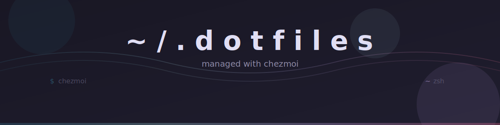

<div align="center">
  
</div>

# Dotfiles

Personal dotfiles managed with [chezmoi](https://www.chezmoi.io/), with a Go-based TUI installer built on [Charm](https://charm.sh/) libraries.

## What's Included

- **Shell** &mdash; Zsh with [Oh My Zsh](https://ohmyz.sh/), [Pure](https://github.com/sindresorhus/pure) prompt, syntax highlighting, autosuggestions
- **Git** &mdash; Delta diffs, commit signing via Proton Pass SSH keys
- **SSH** &mdash; [Proton Pass SSH Agent](https://protonpass.github.io/pass-cli/) as a system service (launchd / systemd)
- **Editors** &mdash; Helix, Neovim, VS Code, Zed
- **Terminal** &mdash; Ghostty, Zellij, fzf, zoxide, eza, bat, lazygit
- **Browser** &mdash; Zen Browser with custom styles, preferences, and extensions
- **Packages** &mdash; 100+ tools defined in `packages.json`, installed via brew, apt, dnf, snap, flatpak, cargo, uv, go, eget, and more
- **macOS** &mdash; System defaults, dock configuration, screenshots, keyboard settings
- **Secrets** &mdash; [Proton Pass CLI](https://protonpass.github.io/pass-cli/) for SSH keys, Git signing keys, and credentials

## Prerequisites

- macOS or Linux (Ubuntu, Fedora, Pop!_OS)
- Internet connection
- A [Proton Pass](https://proton.me/pass) account with:
  - An **SSH** vault containing your SSH key(s)
  - The SSH key's `pass://` URI (used during `chezmoi init`)

## Installation

### Quick Install

```bash
curl -fsSL https://raw.githubusercontent.com/CuriousFurBytes/.dotfiles/main/install.sh | bash
```

The bootstrap script will:

1. Install prerequisites (Homebrew, zerobrew, Go, Cargo, uv; + Snap on Linux)
2. Build and launch the **TUI installer** which guides you through:
   - Selecting packages to install (multi-select form)
   - Installing chezmoi
   - Installing Proton Pass + CLI
   - Authenticating with `pass-cli login`
   - Starting the Proton Pass SSH Agent as a system service
   - Running `chezmoi init` and `chezmoi apply`
   - Authenticating with `gh auth login`
   - Installing gh-dash and all selected packages

Every step prompts for confirmation before running.

### Manual Installation

1. **Install Homebrew**:

   ```bash
   /bin/bash -c "$(curl -fsSL https://raw.githubusercontent.com/Homebrew/install/HEAD/install.sh)"
   ```

2. **Install Proton Pass CLI and authenticate**:

   ```bash
   # macOS
   brew tap protonpass/tap
   brew install protonpass/tap/pass-cli

   # Linux
   curl -fsSL https://proton.me/download/pass-cli/install.sh | bash

   # Authenticate
   pass-cli login
   ```

3. **Start the SSH Agent**:

   ```bash
   # Start as a background service (macOS)
   pass-cli ssh-agent start --vault-name SSH --socket-path ~/.ssh/proton-pass-agent.sock

   # Or register as a launchd service (persists across reboots)
   # See .chezmoiscripts/run_onchange_after_45-setup-proton-pass-ssh-agent.sh.tmpl
   ```

4. **Install and apply dotfiles**:

   ```bash
   brew install chezmoi
   chezmoi init https://github.com/CuriousFurBytes/.dotfiles.git
   chezmoi apply -v
   ```

   During `chezmoi init`, you'll be prompted for:

   | Prompt | Example |
   |--------|---------|
   | Email address | `you@example.com` |
   | Full name | `Your Name` |
   | GitHub username | `yourusername` |
   | Is this a work machine | `false` |
   | NextDNS ID | `abc123` |
   | NextDNS profile name | `My Profile` |
   | Proton Pass SSH Key URI | `pass://SHARE_ID/ITEM_ID` |

5. **Verify**:

   ```bash
   exec $SHELL
   ssh-add -l                # Should show your key from Proton Pass
   ssh -T git@github.com     # Should greet you
   git config --list         # Check signing config
   ```

## SSH Agent

The Proton Pass SSH Agent replaces traditional SSH key files. Instead of storing keys on disk, the agent loads them from your Proton Pass **SSH** vault.

- **macOS**: Registered as a launchd service (`me.proton.pass.ssh-agent`), starts at login
- **Linux**: Registered as a systemd user service (`proton-pass-ssh-agent`), starts at login
- **Socket**: `~/.ssh/proton-pass-agent.sock`
- **Shell**: The zshrc sets `SSH_AUTH_SOCK` automatically when the socket exists
- **SSH config**: `IdentityAgent` points to the Proton Pass socket

### Troubleshooting

```bash
# Check if the agent is running
ls -la ~/.ssh/proton-pass-agent.sock

# Check loaded keys
SSH_AUTH_SOCK=~/.ssh/proton-pass-agent.sock ssh-add -l

# View agent logs (macOS)
cat ~/.local/state/proton-pass-ssh-agent.log

# Restart the agent (macOS)
launchctl kickstart -k "gui/$(id -u)/me.proton.pass.ssh-agent"

# Restart the agent (Linux)
systemctl --user restart proton-pass-ssh-agent
```

## Project Structure

```
.
├── install.sh                    # Bootstrap script (installs Go, builds TUI)
├── installer/                    # Go TUI installer (Huh + BubbleTea + Lipgloss)
│   ├── main.go                   #   Entry point
│   ├── app.go                    #   State machine (11 steps)
│   ├── forms.go                  #   Huh forms (package selection, confirms)
│   ├── terminal.go               #   BubbleTea terminal window for subprocesses
│   ├── packages.go               #   packages.json parser
│   ├── installer.go              #   Package install logic (13 methods)
│   ├── styles.go                 #   Lipgloss styles (Catppuccin Mocha)
│   └── detect.go                 #   OS detection
├── packages.json                 # Package definitions (100+ packages)
├── .chezmoi.toml.tmpl            # Chezmoi config (prompted values)
├── dot_zshrc                     # Zsh configuration
├── dot_gitconfig.tmpl            # Git config with Proton Pass signing
├── dot_common_aliases            # Shell aliases
├── private_dot_ssh/              # SSH config + key templates
├── dot_config/                   # App configurations
│   ├── ghostty/                  #   Terminal emulator
│   ├── helix/                    #   Text editor
│   ├── lazygit/                  #   Git TUI
│   ├── zen-browser/              #   Browser (styles, extensions, prefs)
│   ├── bat/                      #   Syntax highlighting
│   ├── bottom/                   #   System monitor
│   └── ...
├── .chezmoiscripts/              # Chezmoi automation scripts
│   ├── run_onchange_after_25-*   #   Font installation
│   ├── run_onchange_after_40-*   #   Shell configuration
│   ├── run_onchange_after_45-*   #   Proton Pass SSH Agent service
│   ├── run_onchange_after_50-*   #   VS Code extensions
│   ├── run_once_after_60-*       #   Profile picture
│   ├── run_once_after_61-*       #   Wallpaper
│   └── darwin/                   #   macOS defaults, dock, Zen Browser
├── assets/                       # Fonts, images, styles
└── android/                      # Android app configs and install list
```

## Usage

```bash
# Edit a config file
chezmoi edit ~/.zshrc

# Preview changes
chezmoi diff

# Apply changes
chezmoi apply -v

# Pull and apply updates
chezmoi update -v

# Add a new dotfile
chezmoi add ~/.config/app/config
```

## Customization

### Adding Packages

Edit `packages.json` to add a new package:

```json
"my-tool": {
    "description": "Description of the tool",
    "packages": {
        "darwin": { "brew": "my-tool" },
        "ubuntu": { "apt": "my-tool" },
        "fedora": { "dnf": "my-tool" },
        "pop_os": { "apt": "my-tool" }
    }
}
```

Then run `chezmoi apply -v` to trigger the package installer.

### Zen Browser

```bash
chezmoi edit ~/.config/zen-browser/chrome/userChrome.css   # Custom UI styles
chezmoi edit ~/.config/zen-browser/user.js                 # Browser preferences
chezmoi edit ~/.config/zen-browser/extensions.json         # Extension list
```

Extension settings are documented in `~/.config/zen-browser/extension-configs/README.md`.
